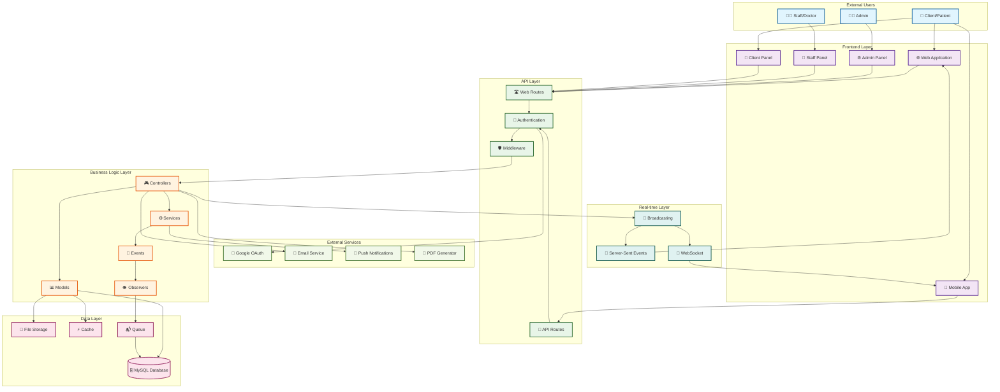
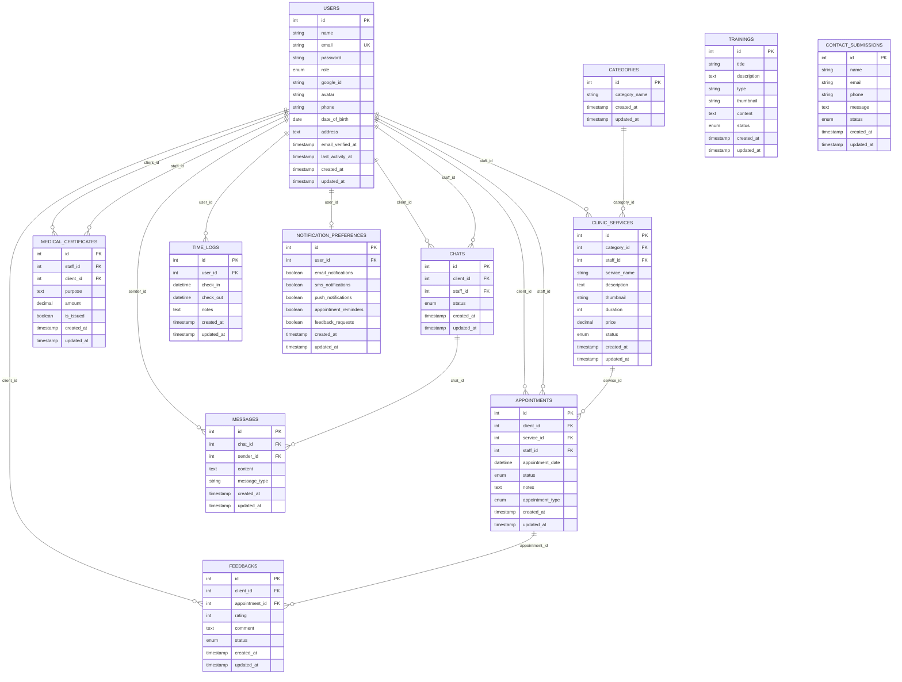
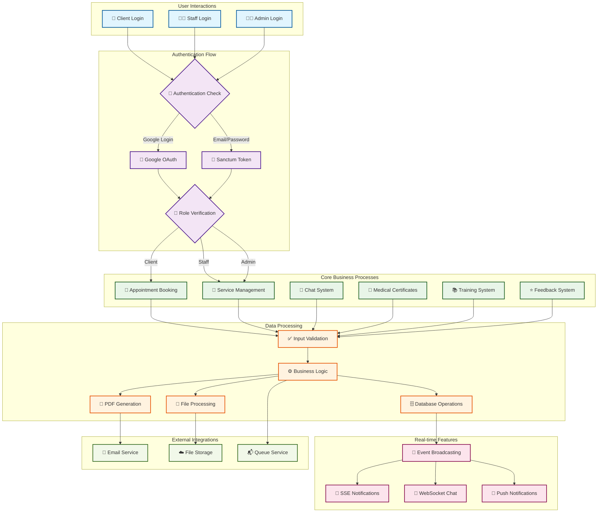

# Dr. V Aesthetic Clinic System Architecture (Simplified)

## Clean System Architecture Diagram

```mermaid
graph TB
    %% External Users
    subgraph "External Users"
        Client[👤 Client/Patient]
        Staff[👩‍⚕️ Staff/Doctor]
        Admin[👨‍💼 Admin]
    end

    %% Frontend Layer
    subgraph "Frontend Layer"
        WebApp[🌐 Web Application]
        MobileApp[📱 Mobile App]
        AdminPanel[⚙️ Admin Panel]
        StaffPanel[👥 Staff Panel]
        ClientPanel[🤝 Client Panel]
    end

    %% API Layer
    subgraph "API Layer"
        WebRoutes[🛣️ Web Routes]
        APIRoutes[🔌 API Routes]
        Auth[🔐 Authentication]
        Middleware[🛡️ Middleware]
    end

    %% Business Logic Layer
    subgraph "Business Logic Layer"
        Controllers[🎮 Controllers]
        Services[⚙️ Services]
        Models[📊 Models]
        Observers[👁️ Observers]
        Events[📡 Events]
    end

    %% Data Layer
    subgraph "Data Layer"
        Database[("🗄️ MySQL Database")]
        Storage[📁 File Storage]
        Cache[⚡ Cache]
        Queue[📬 Queue]
    end

    %% External Services
    subgraph "External Services"
        GoogleAuth[🔑 Google OAuth]
        EmailService[📧 Email Service]
        PushNotifications[🔔 Push Notifications]
        PDFGenerator[📄 PDF Generator]
    end

    %% Real-time Layer
    subgraph "Real-time Layer"
        Broadcasting[📡 Broadcasting]
        SSE[🔄 Server-Sent Events]
        WebSocket[🔌 WebSocket]
    end

    %% User Connections
    Client --> WebApp
    Client --> MobileApp
    Staff --> StaffPanel
    Admin --> AdminPanel
    Client --> ClientPanel

    %% Frontend to API
    WebApp --> WebRoutes
    MobileApp --> APIRoutes
    AdminPanel --> WebRoutes
    StaffPanel --> WebRoutes
    ClientPanel --> WebRoutes

    %% API Layer Connections
    WebRoutes --> Auth
    APIRoutes --> Auth
    Auth --> Middleware
    Middleware --> Controllers

    %% Business Logic Connections
    Controllers --> Services
    Controllers --> Models
    Models --> Database
    Services --> Events
    Events --> Observers
    Observers --> Queue

    %% Data Layer Connections
    Models --> Storage
    Models --> Cache
    Queue --> Database

    %% External Service Connections
    Auth --> GoogleAuth
    Controllers --> EmailService
    Controllers --> PDFGenerator
    Services --> PushNotifications

    %% Real-time Connections
    Controllers --> Broadcasting
    Broadcasting --> SSE
    Broadcasting --> WebSocket
    SSE --> WebApp
    WebSocket --> MobileApp

    %% Styling
    classDef userClass fill:#e1f5fe,stroke:#01579b,stroke-width:2px
    classDef frontendClass fill:#f3e5f5,stroke:#4a148c,stroke-width:2px
    classDef apiClass fill:#e8f5e8,stroke:#1b5e20,stroke-width:2px
    classDef businessClass fill:#fff3e0,stroke:#e65100,stroke-width:2px
    classDef dataClass fill:#fce4ec,stroke:#880e4f,stroke-width:2px
    classDef externalClass fill:#f1f8e9,stroke:#33691e,stroke-width:2px
    classDef realtimeClass fill:#e0f2f1,stroke:#004d40,stroke-width:2px

    class Client,Staff,Admin userClass
    class WebApp,MobileApp,AdminPanel,StaffPanel,ClientPanel frontendClass
    class WebRoutes,APIRoutes,Auth,Middleware apiClass
    class Controllers,Services,Models,Observers,Events businessClass
    class Database,Storage,Cache,Queue dataClass
    class GoogleAuth,EmailService,PushNotifications,PDFGenerator externalClass
    class Broadcasting,SSE,WebSocket realtimeClass
```

## Database Schema Diagram

```mermaid
erDiagram
    USERS {
        int id PK
        string name
        string email UK
        string password
        enum role
        string google_id
        string avatar
        string phone
        date date_of_birth
        text address
        timestamp email_verified_at
        timestamp last_activity_at
        timestamp created_at
        timestamp updated_at
    }

    CATEGORIES {
        int id PK
        string category_name
        timestamp created_at
        timestamp updated_at
    }

    CLINIC_SERVICES {
        int id PK
        int category_id FK
        int staff_id FK
        string service_name
        text description
        string thumbnail
        int duration
        decimal price
        enum status
        timestamp created_at
        timestamp updated_at
    }

    APPOINTMENTS {
        int id PK
        int client_id FK
        int service_id FK
        int staff_id FK
        datetime appointment_date
        enum status
        text notes
        enum appointment_type
        timestamp created_at
        timestamp updated_at
    }

    MEDICAL_CERTIFICATES {
        int id PK
        int staff_id FK
        int client_id FK
        text purpose
        decimal amount
        boolean is_issued
        timestamp created_at
        timestamp updated_at
    }

    FEEDBACKS {
        int id PK
        int client_id FK
        int appointment_id FK
        int rating
        text comment
        enum status
        timestamp created_at
        timestamp updated_at
    }

    CHATS {
        int id PK
        int client_id FK
        int staff_id FK
        enum status
        timestamp created_at
        timestamp updated_at
    }

    MESSAGES {
        int id PK
        int chat_id FK
        int sender_id FK
        text content
        string message_type
        timestamp created_at
        timestamp updated_at
    }

    TRAININGS {
        int id PK
        string title
        text description
        string type
        string thumbnail
        text content
        enum status
        timestamp created_at
        timestamp updated_at
    }

    TIME_LOGS {
        int id PK
        int user_id FK
        datetime check_in
        datetime check_out
        text notes
        timestamp created_at
        timestamp updated_at
    }

    NOTIFICATION_PREFERENCES {
        int id PK
        int user_id FK
        boolean email_notifications
        boolean sms_notifications
        boolean push_notifications
        boolean appointment_reminders
        boolean feedback_requests
        timestamp created_at
        timestamp updated_at
    }

    CONTACT_SUBMISSIONS {
        int id PK
        string name
        string email
        string phone
        text message
        enum status
        timestamp created_at
        timestamp updated_at
    }

    %% Relationships
    USERS ||--o{ APPOINTMENTS : "client_id"
    USERS ||--o{ APPOINTMENTS : "staff_id"
    USERS ||--o{ CLINIC_SERVICES : "staff_id"
    USERS ||--o{ MEDICAL_CERTIFICATES : "client_id"
    USERS ||--o{ MEDICAL_CERTIFICATES : "staff_id"
    USERS ||--o{ FEEDBACKS : "client_id"
    USERS ||--o{ CHATS : "client_id"
    USERS ||--o{ CHATS : "staff_id"
    USERS ||--o{ MESSAGES : "sender_id"
    USERS ||--o{ TIME_LOGS : "user_id"
    USERS ||--o| NOTIFICATION_PREFERENCES : "user_id"

    CATEGORIES ||--o{ CLINIC_SERVICES : "category_id"
    CLINIC_SERVICES ||--o{ APPOINTMENTS : "service_id"
    APPOINTMENTS ||--o{ FEEDBACKS : "appointment_id"
    CHATS ||--o{ MESSAGES : "chat_id"
```

## Data Flow Diagram

```mermaid
flowchart TD
    %% User Interactions
    subgraph "User Interactions"
        ClientLogin[👤 Client Login]
        StaffLogin[👩‍⚕️ Staff Login]
        AdminLogin[👨‍💼 Admin Login]
    end

    %% Authentication Flow
    subgraph "Authentication Flow"
        AuthCheck{🔐 Authentication Check}
        GoogleAuth[🔑 Google OAuth]
        SanctumToken[🎫 Sanctum Token]
        RoleCheck{👥 Role Verification}
    end

    %% Core Business Processes
    subgraph "Core Business Processes"
        AppointmentBooking[📅 Appointment Booking]
        ServiceManagement[🏥 Service Management]
        ChatSystem[💬 Chat System]
        MedicalCertificates[📄 Medical Certificates]
        TrainingSystem[📚 Training System]
        FeedbackSystem[⭐ Feedback System]
    end

    %% Data Processing
    subgraph "Data Processing"
        Validation[✅ Input Validation]
        BusinessLogic[⚙️ Business Logic]
        DatabaseOps[🗄️ Database Operations]
        FileProcessing[📁 File Processing]
        PDFGeneration[📄 PDF Generation]
    end

    %% Real-time Features
    subgraph "Real-time Features"
        EventBroadcasting[📡 Event Broadcasting]
        SSENotifications[🔄 SSE Notifications]
        WebSocketChat[💬 WebSocket Chat]
        PushNotifications[🔔 Push Notifications]
    end

    %% External Integrations
    subgraph "External Integrations"
        EmailService[📧 Email Service]
        StorageService[☁️ File Storage]
        QueueService[📬 Queue Service]
    end

    %% User Flow
    ClientLogin --> AuthCheck
    StaffLogin --> AuthCheck
    AdminLogin --> AuthCheck

    AuthCheck -->|Google Login| GoogleAuth
    AuthCheck -->|Email/Password| SanctumToken
    GoogleAuth --> RoleCheck
    SanctumToken --> RoleCheck

    RoleCheck -->|Client| AppointmentBooking
    RoleCheck -->|Staff| ServiceManagement
    RoleCheck -->|Admin| ServiceManagement

    %% Business Process Flow
    AppointmentBooking --> Validation
    ServiceManagement --> Validation
    ChatSystem --> Validation
    MedicalCertificates --> Validation
    TrainingSystem --> Validation
    FeedbackSystem --> Validation

    Validation --> BusinessLogic
    BusinessLogic --> DatabaseOps
    BusinessLogic --> FileProcessing
    BusinessLogic --> PDFGeneration

    %% Real-time Flow
    DatabaseOps --> EventBroadcasting
    EventBroadcasting --> SSENotifications
    EventBroadcasting --> WebSocketChat
    EventBroadcasting --> PushNotifications

    %% External Service Flow
    FileProcessing --> StorageService
    PDFGeneration --> EmailService
    BusinessLogic --> QueueService

    %% Styling
    classDef userClass fill:#e1f5fe,stroke:#01579b,stroke-width:2px
    classDef authClass fill:#f3e5f5,stroke:#4a148c,stroke-width:2px
    classDef businessClass fill:#e8f5e8,stroke:#1b5e20,stroke-width:2px
    classDef dataClass fill:#fff3e0,stroke:#e65100,stroke-width:2px
    classDef realtimeClass fill:#fce4ec,stroke:#880e4f,stroke-width:2px
    classDef externalClass fill:#f1f8e9,stroke:#33691e,stroke-width:2px

    class ClientLogin,StaffLogin,AdminLogin userClass
    class AuthCheck,GoogleAuth,SanctumToken,RoleCheck authClass
    class AppointmentBooking,ServiceManagement,ChatSystem,MedicalCertificates,TrainingSystem,FeedbackSystem businessClass
    class Validation,BusinessLogic,DatabaseOps,FileProcessing,PDFGeneration dataClass
    class EventBroadcasting,SSENotifications,WebSocketChat,PushNotifications realtimeClass
    class EmailService,StorageService,QueueService externalClass
```

