# Dr. V Aesthetic Clinic System Architecture

## System Architecture Diagram

```mermaid
graph TB
    %% External Users
    subgraph "External Users"
        Client[👤 Client/Patient]
        Staff[👩‍⚕️ Staff/Doctor]
        Admin[👨‍💼 Admin]
    end

    %% Frontend Layer
    subgraph "Frontend Layer"
        WebApp["🌐 Web Application<br/>Blade + Tailwind CSS"]
        MobileApp["📱 Mobile App<br/>React Native"]
        AdminPanel["⚙️ Admin Panel<br/>Filament PHP"]
        StaffPanel["👥 Staff Panel<br/>Filament PHP"]
        ClientPanel["🤝 Client Panel<br/>Filament PHP"]
    end

    %% API Layer
    subgraph "API Layer"
        WebRoutes["🛣️ Web Routes<br/>Laravel Routes"]
        APIRoutes["🔌 API Routes<br/>RESTful API"]
        Auth["🔐 Authentication<br/>Laravel Sanctum"]
        Middleware["🛡️ Middleware<br/>CSRF, Auth, TrackActivity"]
    end

    %% Business Logic Layer
    subgraph "Business Logic Layer"
        Controllers["🎮 Controllers<br/>Appointment, Chat, Feedback"]
        Services["⚙️ Services<br/>AutoIntroMessage, Notification"]
        Models["📊 Models<br/>User, Appointment, Service"]
        Observers["👁️ Observers<br/>AppointmentObserver"]
        Events["📡 Events<br/>AppointmentStatusUpdated, MessageSent"]
    end

    %% Data Layer
    subgraph "Data Layer"
        Database[("🗄️ MySQL Database")]
        Storage["📁 File Storage<br/>Images, Documents"]
        Cache["⚡ Cache<br/>Redis/Memory"]
        Queue["📬 Queue<br/>Background Jobs"]
    end

    %% External Services
    subgraph "External Services"
        GoogleAuth[🔑 Google OAuth]
        EmailService["📧 Email Service<br/>SMTP"]
        PushNotifications[🔔 Push Notifications]
        PDFGenerator["📄 PDF Generator<br/>DomPDF"]
    end

    %% Real-time Layer
    subgraph "Real-time Layer"
        Broadcasting["📡 Broadcasting<br/>Laravel Broadcasting"]
        SSE[🔄 Server-Sent Events]
        WebSocket["🔌 WebSocket<br/>Real-time Chat"]
    end

    %% User Connections
    Client --> WebApp
    Client --> MobileApp
    Staff --> StaffPanel
    Admin --> AdminPanel
    Client --> ClientPanel

    %% Frontend to API
    WebApp --> WebRoutes
    MobileApp --> APIRoutes
    AdminPanel --> WebRoutes
    StaffPanel --> WebRoutes
    ClientPanel --> WebRoutes

    %% API Layer Connections
    WebRoutes --> Auth
    APIRoutes --> Auth
    Auth --> Middleware
    Middleware --> Controllers

    %% Business Logic Connections
    Controllers --> Services
    Controllers --> Models
    Models --> Database
    Services --> Events
    Events --> Observers
    Observers --> Queue

    %% Data Layer Connections
    Models --> Storage
    Models --> Cache
    Queue --> Database

    %% External Service Connections
    Auth --> GoogleAuth
    Controllers --> EmailService
    Controllers --> PDFGenerator
    Services --> PushNotifications

    %% Real-time Connections
    Controllers --> Broadcasting
    Broadcasting --> SSE
    Broadcasting --> WebSocket
    SSE --> WebApp
    WebSocket --> MobileApp

    %% Styling
    classDef userClass fill:#e1f5fe,stroke:#01579b,stroke-width:2px
    classDef frontendClass fill:#f3e5f5,stroke:#4a148c,stroke-width:2px
    classDef apiClass fill:#e8f5e8,stroke:#1b5e20,stroke-width:2px
    classDef businessClass fill:#fff3e0,stroke:#e65100,stroke-width:2px
    classDef dataClass fill:#fce4ec,stroke:#880e4f,stroke-width:2px
    classDef externalClass fill:#f1f8e9,stroke:#33691e,stroke-width:2px
    classDef realtimeClass fill:#e0f2f1,stroke:#004d40,stroke-width:2px

    class Client,Staff,Admin userClass
    class WebApp,MobileApp,AdminPanel,StaffPanel,ClientPanel frontendClass
    class WebRoutes,APIRoutes,Auth,Middleware apiClass
    class Controllers,Services,Models,Observers,Events businessClass
    class Database,Storage,Cache,Queue dataClass
    class GoogleAuth,EmailService,PushNotifications,PDFGenerator externalClass
    class Broadcasting,SSE,WebSocket realtimeClass
```

## Component Details

### 🎯 **Frontend Layer**
- **Web Application**: Blade templates with Tailwind CSS for responsive design
- **Mobile App**: React Native for cross-platform mobile experience
- **Admin Panel**: Filament PHP panel for system administration
- **Staff Panel**: Filament PHP panel for staff operations
- **Client Panel**: Filament PHP panel for patient self-service

### 🔌 **API Layer**
- **Web Routes**: Traditional web routes for server-rendered pages
- **API Routes**: RESTful API endpoints for mobile app integration
- **Authentication**: Laravel Sanctum for API token management
- **Middleware**: CSRF protection, authentication, and activity tracking

### ⚙️ **Business Logic Layer**
- **Controllers**: Handle HTTP requests and business logic
- **Services**: Encapsulate complex business operations
- **Models**: Eloquent ORM models for data representation
- **Observers**: Event-driven model observers
- **Events**: System events for decoupled communication

### 🗄️ **Data Layer**
- **MySQL Database**: Primary data storage with proper relationships
- **File Storage**: Images, documents, and media files
- **Cache**: Redis/Memory caching for performance
- **Queue**: Background job processing for heavy operations

### 🌐 **External Services**
- **Google OAuth**: Social authentication integration
- **Email Service**: SMTP for notifications and communications
- **Push Notifications**: Mobile push notification service
- **PDF Generator**: DomPDF for medical certificate generation

### 📡 **Real-time Layer**
- **Broadcasting**: Laravel broadcasting for real-time updates
- **Server-Sent Events**: Real-time data streaming
- **WebSocket**: Real-time chat and notifications

## Data Flow

1. **User Request** → Frontend Layer
2. **Frontend** → API Layer (Routes/Auth)
3. **API Layer** → Business Logic (Controllers/Services)
4. **Business Logic** → Data Layer (Models/Database)
5. **Data Layer** → External Services (Email/PDF)
6. **Real-time Updates** → Broadcasting → Frontend

## Security Features

- **Role-based Access Control** (Admin, Staff, Doctor, Client)
- **CSRF Protection** for web requests
- **API Token Authentication** for mobile
- **Google OAuth Integration** for social login
- **Activity Tracking** middleware
- **Input Validation** and sanitization

## Scalability Considerations

- **Multi-panel Architecture** for different user types
- **API-first Design** for mobile integration
- **Queue System** for background processing
- **Caching Layer** for performance optimization
- **Real-time Broadcasting** for live updates
- **Modular Service Architecture** for easy extension
