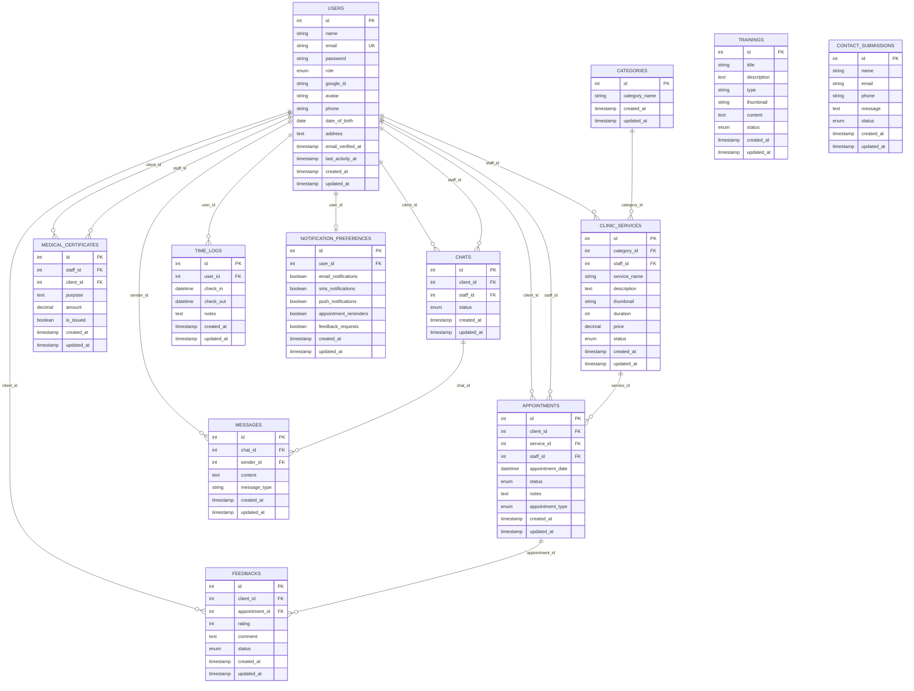
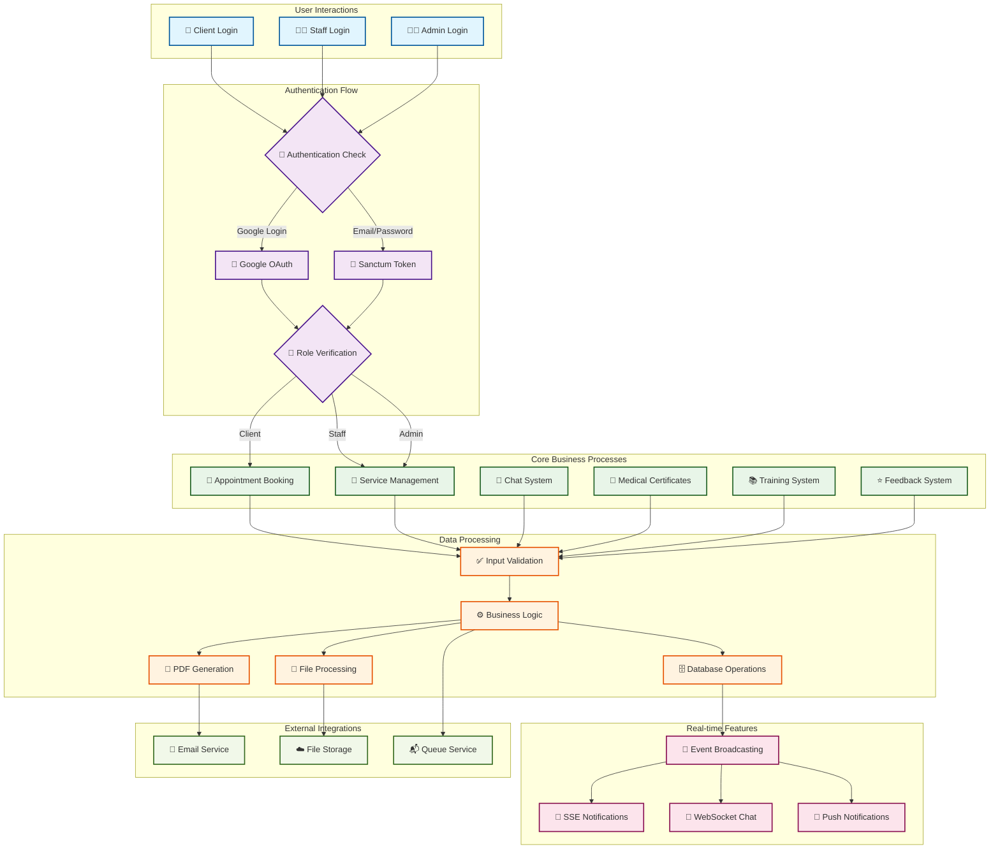

# Database Architecture & Data Flow

## Database Schema Diagram



## System Data Flow Diagram



## API Endpoints Architecture

```mermaid
graph LR
    subgraph "Client API Endpoints"
        ClientAuth[🔐 /api/client/auth]
        ClientAppointments[📅 /api/client/appointments]
        ClientChats[💬 /api/client/chats]
        ClientServices[🏥 /api/client/services]
        ClientProfile[👤 /api/client/profile]
    end

    subgraph "Staff API Endpoints"
        StaffAppointments[📅 /api/staff/appointments]
        StaffChats[💬 /api/staff/chats]
        StaffServices[🏥 /api/staff/services]
        StaffCertificates[📄 /api/staff/certificates]
    end

    subgraph "Admin API Endpoints"
        AdminUsers[👥 /api/admin/users]
        AdminAnalytics[📊 /api/admin/analytics]
        AdminSettings[⚙️ /api/admin/settings]
        AdminReports[📈 /api/admin/reports]
    end

    subgraph "Web Routes"
        WebHome[🏠 /]
        WebServices[🏥 /services]
        WebContact[📞 /contact]
        WebFeedback[⭐ /feedback]
        WebForms[📋 /appointments/{id}/form]
    end

    subgraph "Panel Routes"
        AdminPanel[⚙️ /admin]
        StaffPanel[👥 /staff]
        ClientPanel[🤝 /client]
    end

    %% API Connections
    ClientAuth --> ClientAppointments
    ClientAuth --> ClientChats
    ClientAuth --> ClientServices
    ClientAuth --> ClientProfile

    StaffAppointments --> StaffChats
    StaffAppointments --> StaffServices
    StaffAppointments --> StaffCertificates

    AdminUsers --> AdminAnalytics
    AdminUsers --> AdminSettings
    AdminUsers --> AdminReports

    %% Web Connections
    WebHome --> WebServices
    WebServices --> WebContact
    WebContact --> WebFeedback
    WebFeedback --> WebForms

    %% Panel Connections
    AdminPanel --> AdminUsers
    StaffPanel --> StaffAppointments
    ClientPanel --> ClientAppointments
```

## Security Architecture

```mermaid
graph TD
    subgraph "Security Layers"
        CSRF[🛡️ CSRF Protection]
        Auth[🔐 Authentication]
        Authorization[👥 Authorization]
        Validation[✅ Input Validation]
        Sanitization[🧹 Data Sanitization]
        Encryption[🔒 Data Encryption]
    end

    subgraph "Access Control"
        RoleBased[👤 Role-Based Access]
        PanelAccess[🎛️ Panel Access Control]
        APIAccess[🔌 API Access Control]
        ResourceAccess[📁 Resource Access Control]
    end

    subgraph "Monitoring"
        ActivityTracking[📊 Activity Tracking]
        Logging[📝 Comprehensive Logging]
        AuditTrail[🔍 Audit Trail]
        ErrorHandling[⚠️ Error Handling]
    end

    %% Security Flow
    CSRF --> Auth
    Auth --> Authorization
    Authorization --> Validation
    Validation --> Sanitization
    Sanitization --> Encryption

    %% Access Control Flow
    RoleBased --> PanelAccess
    PanelAccess --> APIAccess
    APIAccess --> ResourceAccess

    %% Monitoring Flow
    ActivityTracking --> Logging
    Logging --> AuditTrail
    AuditTrail --> ErrorHandling

    %% Styling
    classDef securityClass fill:#ffebee,stroke:#c62828,stroke-width:2px
    classDef accessClass fill:#e8f5e8,stroke:#2e7d32,stroke-width:2px
    classDef monitorClass fill:#fff3e0,stroke:#ef6c00,stroke-width:2px

    class CSRF,Auth,Authorization,Validation,Sanitization,Encryption securityClass
    class RoleBased,PanelAccess,APIAccess,ResourceAccess accessClass
    class ActivityTracking,Logging,AuditTrail,ErrorHandling monitorClass
```



