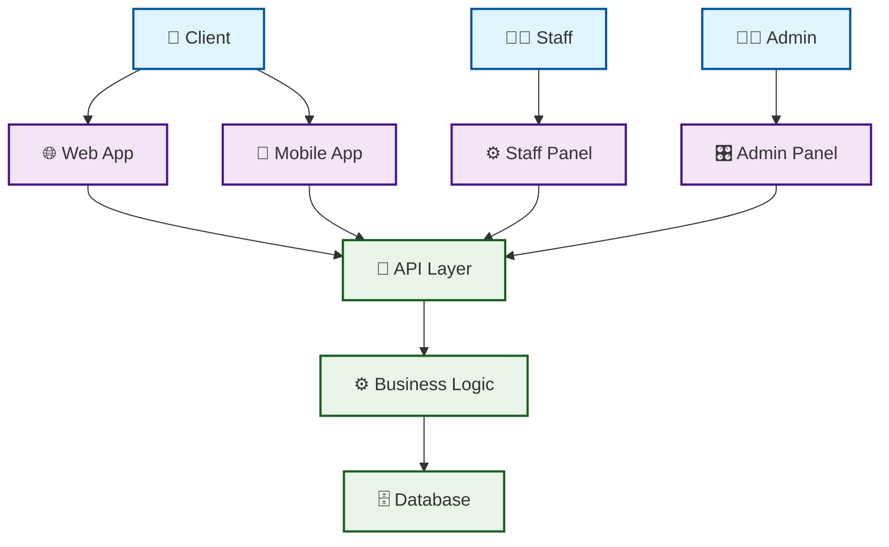

# Quick Test Diagram

## Simple System Overview

```mermaid
graph TD
    A[👤 Client] --> B[🌐 Web App]
    A --> C[📱 Mobile App]
    D[👩‍⚕️ Staff] --> E[⚙️ Staff Panel]
    F[👨‍💼 Admin] --> G[🎛️ Admin Panel]
    
    B --> H[🔌 API Layer]
    C --> H
    E --> H
    G --> H
    
    H --> I[⚙️ Business Logic]
    I --> J[🗄️ Database]
    
    classDef userClass fill:#e1f5fe,stroke:#01579b,stroke-width:2px
    classDef appClass fill:#f3e5f5,stroke:#4a148c,stroke-width:2px
    classDef systemClass fill:#e8f5e8,stroke:#1b5e20,stroke-width:2px
    
    class A,D,F userClass
    class B,C,E,G appClass
    class H,I,J systemClass
```

## Test this diagram at: https://mermaid.live/

